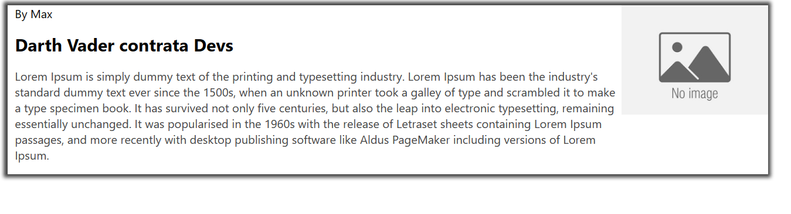

# Projeto Components

## Descrição

Este projeto é uma introdução à construção de um componente usando HTML, CSS e JavaScript puro. O objetivo é entender o funcionamento interno dos componentes para ajudar na compreensão e uso de frameworks.

## Tecnologias Utilizadas

- HTML 5
- CSS 3
- JavaScript

## Como Começar

1. Clone este repositório.
2. Explore o código nos arquivos
3. Abra o arquivo `index.html` no seu navegador para ver mais.

## Estrutura do Projeto

O projeto tem a seguinte estrutura de diretórios:

.
├── assets
│   ├── image
│   └── styles
│       └── style.css
├── source
│   ├── components
│   │   ├── CardNews.js
│   │   └── TituloDinamico.js
│   └── index.html
└── README.md

## Autor

#

## Contribuição

#

## Licença

#
